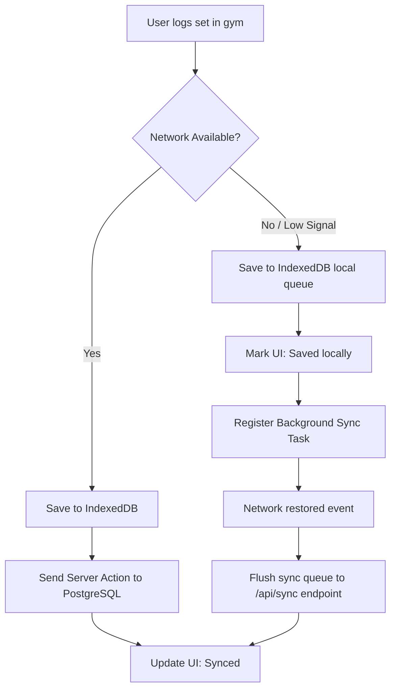
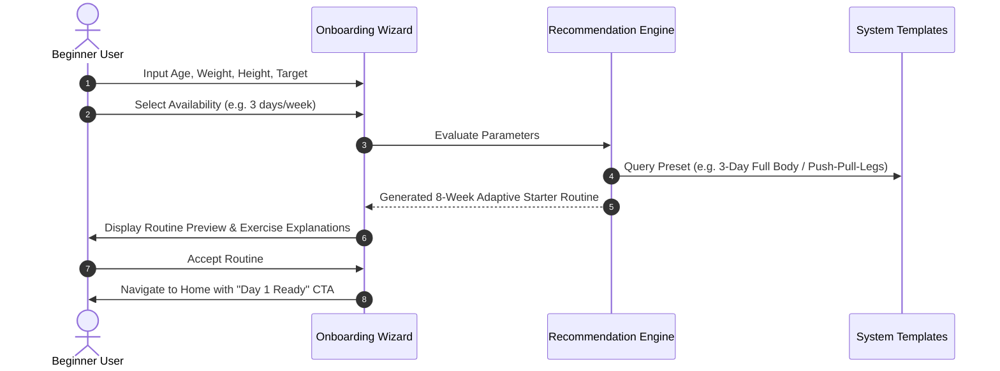
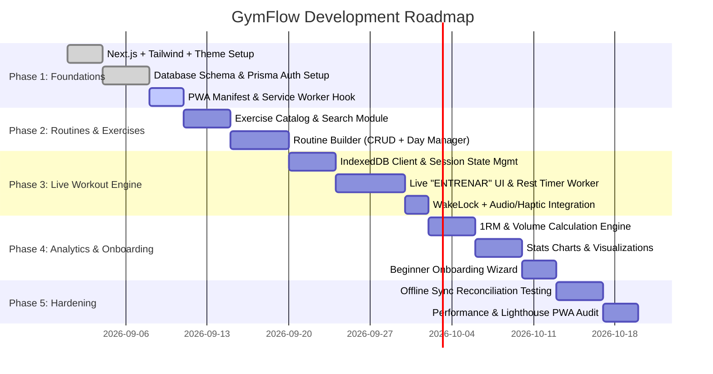
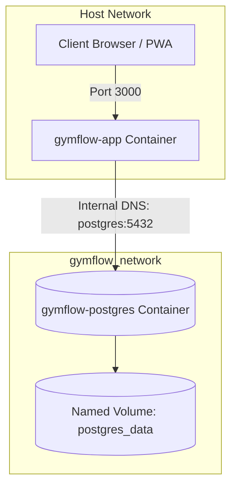

# GymFlow — Technical Architecture & Planning Document

## 1. Executive Architecture Summary

GymFlow is a high-performance, mobile-first Progressive Web Application (PWA) designed for gym workout tracking, routine management, and real-time workout execution. The application provides two distinct UX modes:
- **Beginner Mode:** An onboarding wizard that calculates training parameters (BMI, volume tolerance, available schedule) and prescribes structured routines.
- **Advanced Mode:** A zero-friction, modular routine builder and rapid live session logger.

The technical architecture is built around **Next.js App Router (React Server Components + Client Islands)**, **TypeScript (Strict Mode)**, **Tailwind CSS**, and an **Offline-First PWA Engine** using IndexedDB for zero-latency local logging during gym connectivity drops.

---

## 2. Project Structure (Next.js App Router)

The codebase follows a **Feature-Driven Screaming Architecture** combined with Domain-Driven Design (DDD) principles.

```
gymflow/
├── public/
│   ├── icons/                  # PWA icons (192x192, 512x512, maskable)
│   ├── audio/                  # Audio cues for rest timer (beep.mp3)
│   ├── manifest.json           # Web App Manifest
│   └── sw.js                   # Custom Service Worker (if not generated by Serwist)
├── src/
│   ├── app/                    # Next.js App Router
│   │   ├── (auth)/             # Auth route group (isolated layout)
│   │   │   ├── login/
│   │   │   │   └── page.tsx
│   │   │   ├── register/
│   │   │   │   └── page.tsx
│   │   │   └── layout.tsx
│   │   ├── (onboarding)/       # Beginner onboarding wizard
│   │   │   ├── onboarding/
│   │   │   │   └── page.tsx
│   │   │   └── layout.tsx
│   │   ├── (dashboard)/        # Core authenticated application
│   │   │   ├── routines/
│   │   │   │   ├── page.tsx
│   │   │   │   ├── [id]/
│   │   │   │   │   ├── page.tsx
│   │   │   │   │   └── edit/
│   │   │   │   │       └── page.tsx
│   │   │   │   └── new/
│   │   │   │       └── page.tsx
│   │   │   ├── workout/
│   │   │   │   ├── [routineId]/
│   │   │   │   │   └── active/  # Live "ENTRENAR" execution view
│   │   │   │   │       └── page.tsx
│   │   │   │   └── summary/
│   │   │   │       └── [sessionId]/
│   │   │   │           └── page.tsx
│   │   │   ├── stats/
│   │   │   │   └── page.tsx
│   │   │   ├── profile/
│   │   │   │   └── page.tsx
│   │   │   ├── layout.tsx       # Bottom navigation bar layout
│   │   │   └── page.tsx         # Dashboard home / Daily routine shortcut
│   │   ├── api/                 # Route Handlers (Edge / Serverless)
│   │   │   ├── auth/
│   │   │   ├── sync/            # Offline sync batch processor
│   │   │   └── webhooks/
│   │   ├── globals.css
│   │   ├── layout.tsx           # Root layout (Fonts, Providers, PWA Meta)
│   │   └── not-found.tsx
│   ├── components/              # Shared Presentational & Atomic UI
│   │   ├── ui/                  # Headless/Shadcn primitives (Button, Modal, Input, Card)
│   │   ├── layout/              # BottomNav, TopHeader, MobileContainer
│   │   ├── feedback/            # Toast, Spinner, OfflineBanner
│   │   └── charts/              # Recharts / SVG wrappers for analytics
│   ├── features/                # Feature-Sliced Business Domains
│   │   ├── auth/
│   │   │   ├── components/
│   │   │   ├── hooks/
│   │   │   └── services/
│   │   ├── onboarding/
│   │   │   ├── components/      # Step forms, Routine preview card
│   │   │   ├── hooks/
│   │   │   └── utils/           # Recommendation calculator algorithm
│   │   ├── routines/
│   │   │   ├── components/      # RoutineCard, ExerciseList, DayTabs
│   │   │   ├── hooks/
│   │   │   └── server/          # Server actions for routine CRUD
│   │   ├── live-workout/        # "ENTRENAR" Engine
│   │   │   ├── components/      # ActiveExerciseView, SetRow, RestTimerModal
│   │   │   ├── context/         # WorkoutSessionProvider
│   │   │   ├── hooks/           # useRestTimer, useWakeLock, useWorkoutStorage
│   │   │   └── workers/         # timer.worker.ts (background high-precision timer)
│   │   └── analytics/
│   │   │   ├── components/      # VolumeChart, ConsistencyHeatmap, PRRadar
│   │   │   ├── hooks/
│   │   │   └── utils/           # 1RM calculation formulas (Epley, Brzycki)
│   ├── lib/                     # Infrastructure & utilities
│   │   ├── db/                  # Prisma / Drizzle client definition
│   │   ├── idb/                 # IndexedDB client (idb-keyval or Dexie.js)
│   │   ├── auth/                # NextAuth.js / Supabase Auth config
│   │   ├── pwa/                 # Service Worker registration & install prompt hooks
│   │   └── utils.ts             # Generic helpers (cn, formatDuration, formatWeight)
│   ├── types/                   # Global TypeScript Domain Definitions
│   │   ├── user.ts
│   │   ├── routine.ts
│   │   ├── workout.ts
│   │   └── stats.ts
│   └── middleware.ts            # Auth & Tenant Route Guard
├── next.config.mjs              # Next.js config + PWA wrapper
├── tailwind.config.ts
└── tsconfig.json
```

---

## 3. Data Modeling & TypeScript Contracts

### 3.1 Database Schema (Prisma / PostgreSQL Representation)

```prisma
enum ExperienceLevel {
  BEGINNER
  INTERMEDIATE
  ADVANCED
}

enum GoalType {
  HYPERTROPHY
  STRENGTH
  ENDURANCE
  WEIGHT_LOSS
}

enum Methodology {
  WEIDER
  PUSH_PULL_LEGS
  UPPER_LOWER
  FULL_BODY
  HEAVY_DUTY
  CUSTOM
}

enum MuscleGroup {
  CHEST
  BACK
  LEGS_QUADRICEPS
  LEGS_HAMSTRINGS
  LEGS_CALVES
  SHOULDERS
  BICEPS
  TRICEPS
  CORE
  FULL_BODY
}

enum SetType {
  WARMUP
  NORMAL
  DROPSET
  MYO_REPS
  FAILURE
}

model User {
  id            String          @id @default(cuid())
  email         String          @unique
  name          String?
  passwordHash  String?
  createdAt     DateTime        @default(now())
  updatedAt     DateTime        @updatedAt

  profile       UserProfile?
  routines      Routine[]
  workoutLogs   WorkoutSession[]
  personalRecords PersonalRecord[]

  @@map("users")
}

model UserProfile {
  id              String          @id @default(cuid())
  userId          String          @unique
  user            User            @relation(fields: [userId], references: [id], onDelete: Cascade)
  experienceLevel ExperienceLevel @default(BEGINNER)
  goal            GoalType        @default(HYPERTROPHY)
  weightKg        Float?
  heightCm        Float?
  birthDate       DateTime?
  preferredDays   Int             @default(3)
  restSoundEnabled Boolean        @default(true)
  vibrationEnabled Boolean        @default(true)
  theme           String          @default("dark")

  @@map("user_profiles")
}

model Routine {
  id           String          @id @default(cuid())
  userId       String
  user         User            @relation(fields: [userId], references: [id], onDelete: Cascade)
  name         String
  description  String?
  methodology  Methodology     @default(CUSTOM)
  isArchived   Boolean         @default(false)
  createdAt    DateTime        @default(now())
  updatedAt    DateTime        @updatedAt

  days         RoutineDay[]
  sessions     WorkoutSession[]

  @@index([userId])
  @@map("routines")
}

model RoutineDay {
  id           String          @id @default(cuid())
  routineId    String
  routine      Routine         @relation(fields: [routineId], references: [id], onDelete: Cascade)
  dayIndex     Int             // 0 = Day A, 1 = Day B, etc.
  name         String          // e.g., "Push - Chest & Triceps"
  restDay      Boolean         @default(false)

  exercises    RoutineExercise[]

  @@index([routineId])
  @@map("routine_days")
}

model Exercise {
  id              String            @id @default(cuid())
  name            String            @unique
  description     String?
  targetMuscle    MuscleGroup
  secondaryMuscles MuscleGroup[]
  isCustom        Boolean           @default(false)
  userId          String?           // Nullable: standard library vs custom user-created
  
  routineItems    RoutineExercise[]
  sessionSets     SetLog[]

  @@map("exercises")
}

model RoutineExercise {
  id             String          @id @default(cuid())
  routineDayId   String
  routineDay     RoutineDay      @relation(fields: [routineDayId], references: [id], onDelete: Cascade)
  exerciseId     String
  exercise       Exercise        @relation(fields: [exerciseId], references: [id], onDelete: Restrict)
  orderIndex     Int
  targetSets     Int             @default(3)
  targetRepsMin  Int             @default(8)
  targetRepsMax  Int             @default(12)
  targetRir      Int?            // Reps In Reserve (0-4)
  restTimeSec    Int             @default(90)
  notes          String?

  @@index([routineDayId])
  @@map("routine_exercises")
}

model WorkoutSession {
  id           String          @id @default(cuid())
  userId       String
  user         User            @relation(fields: [userId], references: [id], onDelete: Cascade)
  routineId    String?
  routine      Routine?        @relation(fields: [routineId], references: [id], onDelete: SetNull)
  name         String
  startedAt    DateTime
  endedAt      DateTime?
  durationSec  Int             @default(0)
  totalVolumeKg Float          @default(0)
  notes        String?

  sets         SetLog[]

  @@index([userId, startedAt])
  @@map("workout_sessions")
}

model SetLog {
  id               String         @id @default(cuid())
  workoutSessionId String
  workoutSession   WorkoutSession @relation(fields: [workoutSessionId], references: [id], onDelete: Cascade)
  exerciseId       String
  exercise         Exercise       @relation(fields: [exerciseId], references: [id], onDelete: Restrict)
  setNumber        Int
  setType          SetType        @default(NORMAL)
  weightKg         Float
  reps             Int
  rir              Int?
  isCompleted      Boolean        @default(true)
  createdAt        DateTime       @default(now())

  @@index([workoutSessionId])
  @@index([exerciseId])
  @@map("set_logs")
}

model PersonalRecord {
  id           String      @id @default(cuid())
  userId       String
  user         User        @relation(fields: [userId], references: [id], onDelete: Cascade)
  exerciseId   String
  oneRepMaxEst Float       // Calculated 1RM
  maxWeightKg  Float       // Absolute heaviest weight logged
  maxVolumeSet Float       // Max weight * reps in single set
  achievedAt   DateTime    @default(now())

  @@unique([userId, exerciseId])
  @@map("personal_records")
}
```

---

### 3.2 Strict TypeScript Domain Types

```typescript
// src/types/workout.ts

export type ExperienceLevel = 'BEGINNER' | 'INTERMEDIATE' | 'ADVANCED';
export type GoalType = 'HYPERTROPHY' | 'STRENGTH' | 'ENDURANCE' | 'WEIGHT_LOSS';
export type Methodology = 'WEIDER' | 'PUSH_PULL_LEGS' | 'UPPER_LOWER' | 'FULL_BODY' | 'HEAVY_DUTY' | 'CUSTOM';
export type MuscleGroup = 
  | 'CHEST' 
  | 'BACK' 
  | 'LEGS_QUADRICEPS' 
  | 'LEGS_HAMSTRINGS' 
  | 'LEGS_CALVES' 
  | 'SHOULDERS' 
  | 'BICEPS' 
  | 'TRICEPS' 
  | 'CORE' 
  | 'FULL_BODY';

export type SetType = 'WARMUP' | 'NORMAL' | 'DROPSET' | 'MYO_REPS' | 'FAILURE';

export interface SetDraft {
  id: string;
  setNumber: number;
  setType: SetType;
  weightKg: number;
  reps: number;
  rir?: number;
  isCompleted: boolean;
  previousWeightKg?: number;
  previousReps?: number;
}

export interface ActiveExerciseSession {
  exerciseId: string;
  exerciseName: string;
  targetMuscle: MuscleGroup;
  restTimeSec: number;
  notes?: string;
  sets: SetDraft[];
}

export interface ActiveWorkoutState {
  sessionId: string;
  routineId?: string;
  routineDayId?: string;
  sessionName: string;
  startedAt: number; // Unix timestamp
  elapsedSeconds: number;
  isPaused: boolean;
  currentExerciseIndex: number;
  exercises: ActiveExerciseSession[];
  restTimer: {
    active: boolean;
    durationSec: number;
    remainingSec: number;
    timerEndTimestamp?: number;
  };
}
```

---

## 4. Progressive Web App (PWA) & Offline-First Strategy

### 4.1 PWA Configuration Stack
- **Framework integration**: `@serwist/next` (modern successor to `next-pwa`).
- **Offline Storage**: Dexie.js (IndexedDB wrapper) for client-side transactional persistence of ongoing and historical sessions.

### 4.2 Web App Manifest (`public/manifest.json`)
```json
{
  "name": "GymFlow — Smart Workout Tracker",
  "short_name": "GymFlow",
  "description": "Mobile-first Progressive Web App for gym routine execution and progressive overload tracking",
  "start_url": "/?source=pwa",
  "display": "standalone",
  "orientation": "portrait",
  "background_color": "#09090B",
  "theme_color": "#09090B",
  "icons": [
    {
      "src": "/icons/icon-192x192.png",
      "sizes": "192x192",
      "type": "image/png"
    },
    {
      "src": "/icons/icon-512x512.png",
      "sizes": "512x512",
      "type": "image/png"
    },
    {
      "src": "/icons/icon-512x512-maskable.png",
      "sizes": "512x512",
      "type": "image/png",
      "purpose": "maskable"
    }
  ],
  "shortcuts": [
    {
      "name": "Start Workout",
      "short_name": "Train",
      "description": "Jump straight into today's workout",
      "url": "/workout/quick-start",
      "icons": [{ "src": "/icons/train-shortcut.png", "sizes": "96x96" }]
    }
  ]
}
```

### 4.3 Offline Caching & Synchronization Workflow


### 4.4 Hardware APIs for Native-like Experience
1. **Screen Wake Lock API (`navigator.wakeLock`)**:
   - Keeps mobile screen awake during an active workout so users do not have to unlock their phone with sweaty hands.
2. **Vibration API (`navigator.vibrate`)**:
   - Triggers a distinct haptic pattern `[200, 100, 200, 100, 400]` when the rest timer reaches `00:00`.
3. **Web Audio API**:
   - Synthesizes or plays high-pitch audio tone on rest completion even when media volume is low.
4. **Web Workers for Timers**:
   - Mobile browsers throttle `setInterval` when the tab is hidden. A dedicated Web Worker (`timer.worker.ts`) or timestamp differential algorithm (`Date.now() - targetTimestamp`) guarantees millisecond-accurate rest countdowns in background mode.

---

## 5. UI/UX Architecture & Screen Definitions

### 5.1 User Personas & Flows

#### Flow A: Beginner User (Guided Onboarding)


#### Flow B: Advanced User (Direct Power-User)
- Skips wizard directly to `/routines/new`.
- High-density table/list builder.
- Rapid exercise picker with fuzzy search, recent exercise history, and 1RM reference tags.
- Direct override of rest intervals, RIR, and custom superset groupings.

---

### 5.2 The "ENTRENAR" (Live Workout) Interface

The Live Workout view is a distraction-free, full-viewport client island (`/workout/[routineId]/active`).

```
+-------------------------------------------------------------+
| [X End]     PULL DAY - HYPERTROPHY       00:42:15  [Pause]  |
| Progress: [========-----------------] 3/8 Exercises         |
+-------------------------------------------------------------+
| EXERCISE 2 of 8                                             |
| Lat Pulldown (Wide Grip)                     [History / PR] |
| Target: 3 Sets x 8-12 Reps | RIR 1-2 | Rest: 90s            |
+-------------------------------------------------------------+
| SET   PREVIOUS       KG          REPS     RIR     DONE      |
|  1    70 kg x 10    [ 72.5 ]    [ 10 ]   [ 2 ]    [ (V) ]   |
|  2    70 kg x 8     [ 72.5 ]    [  8 ]   [ 1 ]    [ (V) ]   |
|  3    65 kg x 10    [ .... ]    [ .. ]   [ . ]    [ ( ) ]   |
|                                                             |
| [+ Add Set]                                                 |
+-------------------------------------------------------------+
| REST TIMER OVERLAY (Floating Bottom Bar or Modal)           |
| Rest Remaining: 01:15  [-15s] [+15s] [Skip]                 |
| Next: Set 3 (Target: 72.5 kg x 8+)                          |
+-------------------------------------------------------------+
| [ < Prev Exercise ]                    [ Next Exercise > ]  |
+-------------------------------------------------------------+
```

#### Live Mode Interaction Rules:
1. When a set checkbox `[DONE]` is clicked:
   - Mark set complete and persist draft immediately to IndexedDB.
   - Automatically trigger Rest Timer countdown with visual progress bar.
   - Pre-populate the next set row with previous set's weight and reps.
2. Rest Timer behavior:
   - Shows a bottom floating pill when scrolling through other exercises.
   - Triggers device vibration + audio beep when reaching `00:00`.
   - Allows quick `+15s` or `-15s` adjustments with single taps.

---

## 6. Analytics & Progress Metrics Engine

### 6.1 Core Key Performance Indicators (KPIs)

| Metric | Calculation Formula | Purpose | Visualization |
| :--- | :--- | :--- | :--- |
| **Total Volume Load** | $\sum (\text{Weight}_{\text{kg}} \times \text{Reps})$ | Measures absolute mechanical workload per session/week | Bar chart with 4-week moving average |
| **Estimated 1RM (Epley)** | $\text{Weight} \times (1 + \frac{\text{Reps}}{30})$ | Tracks strength gains without requiring dangerous 1RM max tests | Line chart by exercise over time |
| **Estimated 1RM (Brzycki)**| $\text{Weight} \times \frac{36}{37 - \text{Reps}}$ | Secondary benchmark for reps $\le 10$ | Tooltip / Comparative badge |
| **Consistency / Streak** | Consecutive weeks meeting target frequency | Behavioral habit reinforcement | GitHub-style activity contribution grid |
| **Muscle Volume Distribution**| Sets per `MuscleGroup` per week | Detects under-trained or over-trained muscle groups | Radar / Spider chart vs optimal volume landmarks |
| **Progressive Overload Delta**| $\Delta \text{Volume}$ or $\Delta \text{Weight}$ for same exercise | Validates progressive overload execution | Green/Red indicator on exercise start card |

---

## 7. Phased Implementation Roadmap



### Phase Details:
- **Phase 1 (Core Foundation & Setup):**
  - Scaffold Next.js 15+ App Router project with TypeScript strict mode.
  - Setup Tailwind CSS with a high-contrast dark theme optimized for OLED gym environments.
  - Implement NextAuth.js / Supabase Auth with PostgreSQL.
  - Setup `@serwist/next` PWA manifest, service worker registration, and installation banner.

- **Phase 2 (Routine Management & Exercise Catalog):**
  - Seed default exercise library with muscle group categorization.
  - Build routine CRUD with flexible day sequencing (Weider, PPL, Upper/Lower, Heavy Duty).
  - Implement responsive drag-and-drop or touch-friendly reordering for exercises and sets.

- **Phase 3 (Live "ENTRENAR" Workout Engine):**
  - Build `WorkoutSessionProvider` with IndexedDB persistence to survive tab closes or crashes.
  - Implement high-precision Rest Timer utilizing Web Worker and timestamp difference algorithm.
  - Integrate Web Audio API and Navigator Vibration API for timer alert cues.
  - Integrate Screen Wake Lock API during active workout sessions.

- **Phase 4 (Analytics, Metrics & Onboarding):**
  - Build progressive overload calculation utilities (1RM Epley/Brzycki, volume load).
  - Implement Interactive Charts with Recharts (Volume Load progression, Muscle distribution radar, Consistency calendar).
  - Build Beginner Onboarding wizard with adaptive routine recommendation logic.

- **Phase 5 (Performance Optimization & Offline Sync):**
  - Implement background sync queue to seamlessly flush local sets to PostgreSQL when reconnecting.
  - Achieve 95+ score on Lighthouse PWA, Performance, and Accessibility audits.

---

## 8. Production Containerization Strategy (Docker & Docker Compose)

### 8.1 Multi-Stage Docker Architecture
The Next.js application utilizes Next.js **Standalone Output mode** (`output: "standalone"` in `next.config.ts`), producing an ultra-lightweight Node.js production server containing only traced dependencies and static bundles.

- **Base Image:** `node:22-alpine` with `libc6-compat` and `openssl` (required for Prisma engine binaries on Alpine).
- **Stage 1 (`deps`):** Pre-caches dependencies and runs `npm ci` with `package.json` and `prisma/schema.prisma`.
- **Stage 2 (`builder`):** Runs `npx prisma generate` and `npm run build`, generating `.next/standalone` and pre-compiled client assets in `.next/static`.
- **Stage 3 (`runner`):** Minimal execution runtime running under an unprivileged user (`nextjs:nodejs`, UID 1001), exposing port 3000.

### 8.2 Production Orchestration Architecture (`docker-compose.yml`)



### 8.3 Services Specification

| Service | Image | Responsibility | Healthcheck & Persistence |
| :--- | :--- | :--- | :--- |
| **`postgres`** | `postgres:16-alpine` | Relational database engine for users, routines, sessions, and analytics | `pg_isready` check every 5s; named volume `postgres_data` mapped to `/var/lib/postgresql/data` |
| **`app`** | Built from `Dockerfile` | Next.js standalone server + Prisma Client ORM | Starts after `postgres` is marked healthy; runs as non-root `nextjs` user |

### 8.4 Production Operations & Deployment Commands

```bash
# 1. Start full production stack in detached mode
docker compose up --build -d

# 2. Apply Prisma database migrations in container
docker compose exec app npx prisma migrate deploy

# 3. Seed initial standard exercise database
docker compose exec app npx prisma db seed

# 4. View application and database logs
docker compose logs -f app postgres

# 5. Graceful shutdown
docker compose down
```

---

## 9. Future Enhancements (v2 Roadmap: AI Workout Coach & Assistant)

### 9.1 Overview & Goals
The AI Workout Coach is an intelligent conversational agent designed to provide tailored workout recommendations, exercise substitutions (e.g., injuries or equipment limitations), and real-time performance feedback directly within GymFlow.

### 9.2 Token Safety & Cost-Control Architecture (Zero-Cost Free Tier)
To prevent unexpected LLM billing and protect developer API budgets:
1. **Model Engine**: Google **Gemini 2.0 Flash** via `@google/genai` (utilizing the generous Free Tier of up to 1,500 requests/day at zero monetary cost).
2. **Database Rate Limiting**:
   - `UserProfile` model tracks `dailyAiRequestsCount` (default max: 5 requests/day per authenticated user) and `lastAiRequestTimestamp`.
   - Daily quota resets at `00:00 UTC`.
   - Protects against malicious automated abuse and unexpected token consumption.
3. **Bring-Your-Own-Key (BYOK) Fallback**:
   - Power users can optionally provide their own personal Gemini or OpenAI API Key in `/profile` for unlimited requests.

### 9.3 Context Injection & Domain Grounding (Lightweight RAG)
- **System Prompt**: Injected with standard biomechanical principles (RIR 1-3, progressive overload, volume landmarks).
- **Exercise Catalog Grounding**: The backend injects the active database exercise catalog so the AI only suggests existing exercises with valid IDs.
- **User Profile Grounding**: Injects user experience level, goal (Hypertrophy, Strength, etc.), and recent PR achievements.

### 9.4 Structured Outputs & One-Click Routine Import
- The model outputs responses in dual-mode (Markdown explanation + JSON Routine Payload).
- The frontend chat interface parses the JSON payload and renders an interactive **"Guardar rutina en mi cuenta"** action card that writes directly to PostgreSQL via Prisma.

### 9.5 Planned File Structure (v2)
- `src/features/ai-coach/server/coach-actions.ts`: Gemini 2.0 Flash client with quota check and structured schema validation.
- `src/features/ai-coach/components/coach-chat-view.tsx`: Real-time streaming chat UI with suggested prompts.
- `src/app/(dashboard)/coach/page.tsx`: Dedicated AI Coach screen.


